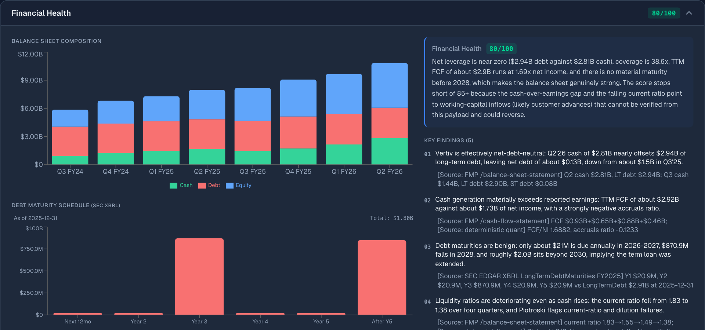
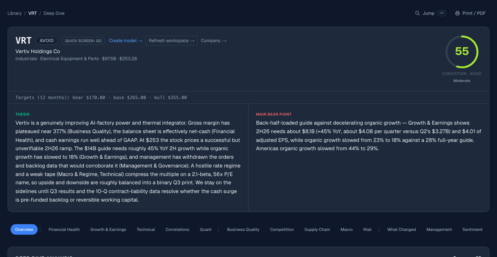
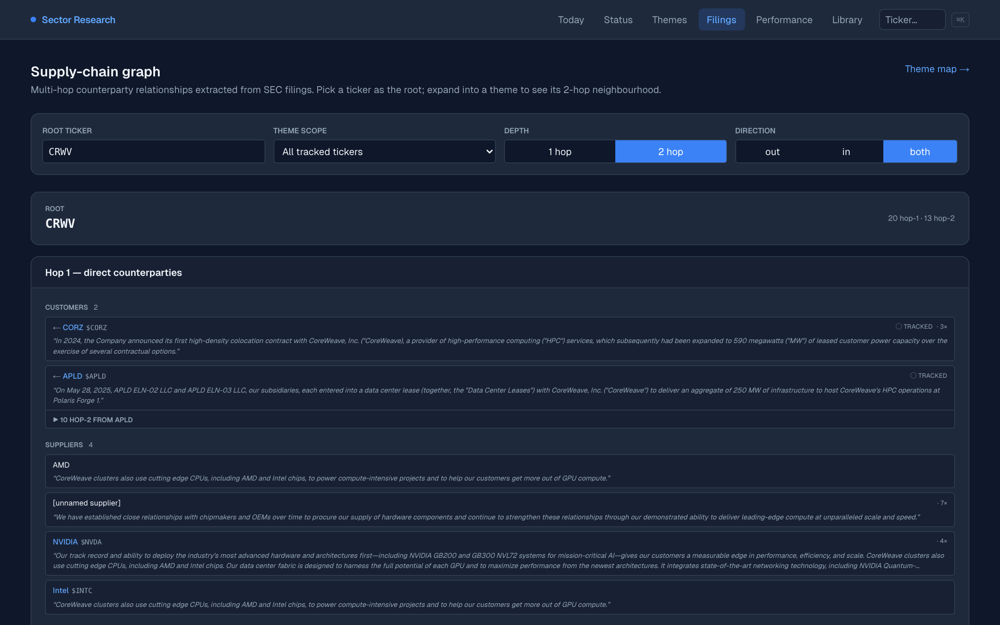
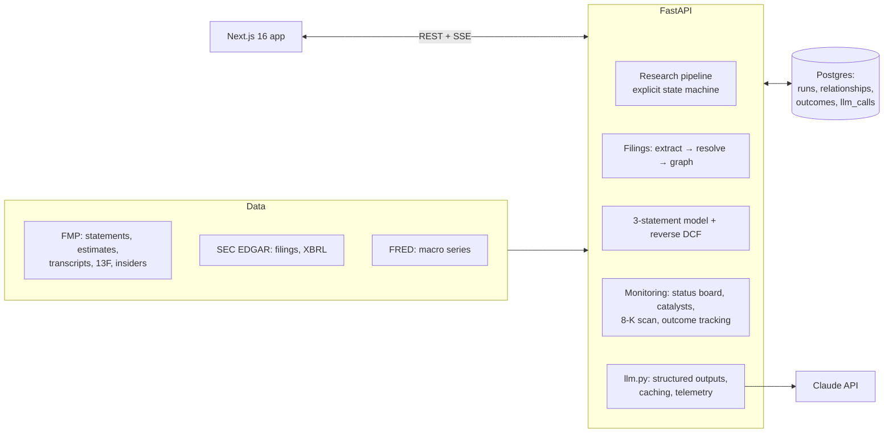
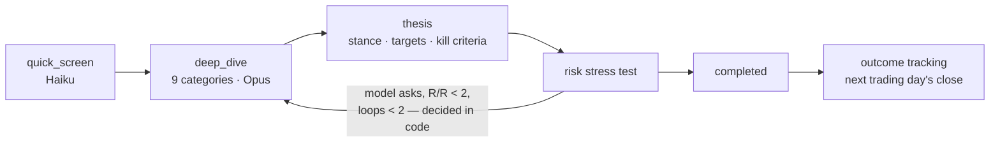
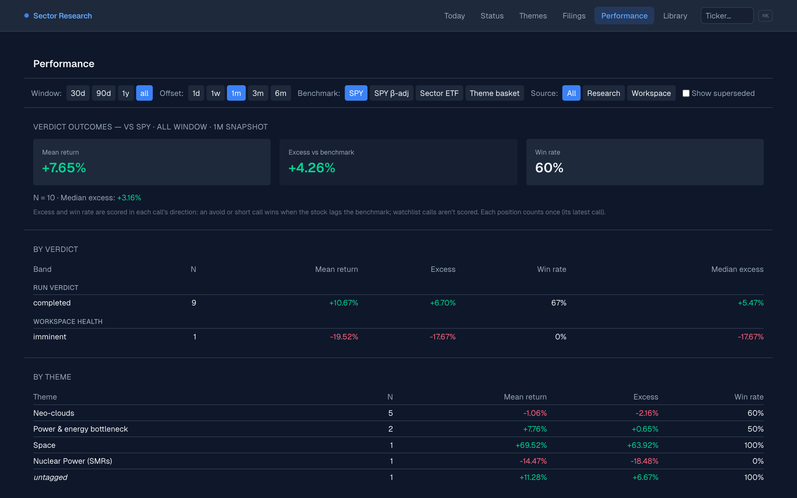

# Sector Research

**An AI equity-research analyst that turns SEC filings, fundamentals and earnings calls into cited
theses with falsifiable kill criteria — then monitors them, and keeps score.**

Built solo with Claude Code (Opus + Haiku in the product; agents under my direction for most of the
code). What I'd point to is not the volume but the boundary: deterministic finance math and routing
in code, judgment in the model, and an eval harness and CI gates that check the model's work.

> Personal research tool, not investment advice. It has no track record worth claiming yet — see
> [Keeping score](#keeping-score).



<sub>One of nine deep-dive categories for Vertiv (VRT). Every finding carries a `[Source: …]` tag —
an FMP endpoint, an SEC XBRL fact, or the deterministic quant layer.</sub>

| | |
|---|---|
| Research run | ~$2 and ~7 minutes (VRT, two risk loops: $2.07, 6.6 min, 25 model calls) |
| Stack | FastAPI · async SQLAlchemy · Postgres · Next.js 16 · Claude Opus 5.5 + Haiku 4.5 |
| Tests | 1,100 backend tests, an end-to-end research run on a real Postgres, Playwright + axe on every page, a live smoke of all 19 model call paths |
| Evals | thesis grounding, citation and consistency checks; rerun dispersion; a cross-model rubric judge |
| History | 657 commits since April 2026, 82% co-authored with Claude; 5 ADRs |

---

## What it does

**1. Cited research → thesis → kill criteria → monitoring.** Push a ticker through a four-phase
pipeline. A fast screen, then nine deep-dive categories in parallel, each fed FMP statements,
transcripts, SEC filing excerpts, FRED macro data and a deterministic quant layer (Piotroski,
Altman, Beneish, accruals). A thesis step turns them into a stance (long / avoid / short), 12-month
price targets, catalysts and kill criteria. A risk step stress-tests it. The status board then tracks
every live thesis — health, the next catalyst, which kill criteria have tripped — and the performance
page scores each call against SPY, a beta-adjusted SPY, the sector ETF and the theme.



**2. SEC filings → supply-chain graph.** Filings are pulled from EDGAR and split into sections; a
Haiku pass extracts customers, suppliers, partners and competitors with verbatim quotes; names are
resolved to tickers by fuzzy match against EDGAR's company list, with a curation queue for the rest.
The graph feeds the deep-dive prompts ("use these as anchors, don't re-quote") and a two-hop explorer,
so a question like "what does my universe say about CoreWeave's suppliers?" has an answer.



**3. Measuring the model.** Every model call is recorded with its tokens, latency and cost; theses
are checked against the data they were written from; repeated runs measure how stable the output is;
a second model grades quality. See [Evidence](#evidence).

Also: an editable three-statement model per ticker, AI-seeded, with a reverse DCF that solves what
the market price implies; a thesis-refresh loop after earnings; an 8-K and insider/congress-trade
scanner; a trade journal. [docs/ARCHITECTURE.md](docs/ARCHITECTURE.md) is the full reference.

---

## Architecture





---

## AI design decisions

- **The model judges; code decides.** Reward/risk is computed from the price and the model's targets,
  not taken from the model; whether the risk step loops back is a rule in `graph/routing.py`
  (before, the prompt asked the model to apply the rules itself, and 18 of 22 runs looped). The quick
  screen's verdict is the sum of its dimension scores, not the model's own total.
- **Deterministic finance stays deterministic.** The three-statement model, DCF, reverse DCF, quant
  fingerprint and outcome maths are plain Python with tests. The model proposes forecast drivers; the
  engine balances the statements (no plug) and values them.
- **Structured outputs everywhere, and no invented defaults.** Every JSON-producing call goes through
  one function using the API's native structured outputs. Truncation and refusals raise instead of
  being parsed around; an over-long list is clamped to its bound because the API treats length limits
  as hints; nothing is filled in when output is missing.
- **An explicit state machine, not a framework.** LangGraph was compiled but never invoked; I removed
  it ([ADR-0004](docs/adr/0004-explicit-state-machine-over-langgraph.md)), and a follow-up phase that
  ran every time but never acted — 0 of 273 priority-1 questions ever qualified
  ([ADR-0005](docs/adr/0005-remove-targeted-followup-phase.md)).
- **Model tiers by job.** Opus 5.5 at medium effort for synthesis; Haiku 4.5 for screening,
  classification and extraction.
- **Caching designed for fan-out.** The nine deep-dive calls share one cached prefix (system prompt +
  data). Parallel requests can't read an entry still being written, so the first category starts
  alone and the other eight launch when its response begins streaming.
- **Citations as a data type.** Every data-client method returns `(data, Citation)`; the report
  renders them next to the claims they support.

---

## Evidence

### Evals ([backend/evals](backend/evals/README.md))

The thesis step is evaluated on frozen inputs so a prompt change can be compared like for like.

| Check | Result |
|---|---|
| Numbers in a thesis found in the raw FMP/FRED data | **67%** median (21 stored theses). Measured against the prompt instead it's 98% — inflated, because the prompt is mostly the model's own deep-dive text |
| Stance vs targets vs price; kill criteria and pre-mortem present | new-format theses pass; 9 of 21 older ones lacked kill criteria |
| Thesis evidence carrying a source tag | 0% — the next prompt target |
| Stability across reruns (pilot, NVDA + ORCL) | same stance every time; conviction ±2; base target within 1.2% |
| Rubric judge (Claude Sonnet 5, a different model from the writer) | 4.5 / 5.0 / 4.5 / 3.5–4.0 / 4.5 — lenient on evidence, so it needs calibrating before it picks between prompts |

### Cost and latency (from the `llm_calls` table)

| Phase | Calls | Cost |
|---|---|---|
| Quick screen (Haiku) | 1 | $0.01 |
| Deep dive incl. transcript analysis (two loop-backs) | 18 | $1.41 |
| Thesis (×3) | 3 | $0.47 |
| Risk stress test (×3) | 3 | $0.17 |
| **One VRT run** | **25** | **$2.07 · 6.6 min** |

Restructuring the prompts for caching and reusing transcript analysis across loops took the same run
from $2.92 and 38 calls to $2.07 and 25 (cache hits 6.6% → 28.5% of prompt tokens). About 70% of what
remains is output (thinking included), so effort level is the next lever, not caching.

### CI gates

- Backend: ruff and 1,100 unit tests; migrations must apply to an empty Postgres and match the models.
- An end-to-end research run on that database, with recorded FMP responses and a fake model — every
  phase, a loop-back, the cache fan-out and the telemetry — with live HTTP blocked (1 second).
- Every model call site must have a probe in the live smoke test, which runs nightly (19 paths, $0.08).
- Frontend: types, lint, 72 unit tests, and Playwright on every page plus a finished report: no
  console errors, no serious or critical axe findings, no exceptions list.

---

## Keeping score

Each finished call is recorded at the next trading day's close and snapshotted at 1 day to 6 months,
scored in the direction of the call against four benchmarks. With ten live calls so far, the honest
reading is that there's no detectable edge — the early outperformance is mostly theme beta, and the
three-month numbers are worse than the one-month ones. The point is the harness, not the returns:
from here on every call is recorded automatically before its outcome is known.



---

## How it was built

I directed the work and Claude Code wrote most of it: written specs and implementation plans before
building (34 and 39 so far), ADRs for the decisions that matter, a review pass before merging, and
periodic audits of my own AI-written code. The biggest lesson came from one of those audits: a fix
that lived only in a commit message (assistant prefill breaks on newer Claude models) came back at
five call sites. It's now a guard test and a nightly live smoke. [PROCESS.md](PROCESS.md) is the longer account.

---

## Running it

Needs Python 3.12, Node 24, Postgres, and API keys for Anthropic and FMP (FRED optional).

```bash
# .env at the repo root: ANTHROPIC_API_KEY, FMP_API_KEY, X_BEARER_TOKEN, DATABASE_URL, DATABASE_URL_SYNC
python -m venv backend/venv && source backend/venv/bin/activate
pip install -r backend/requirements.txt
(cd backend && alembic upgrade head)
uvicorn backend.app.main:app --reload          # from the repo root

cd frontend && npm install && npm run dev       # http://localhost:3000
```

Desktop-first, single user, no auth — a local tool. Tests: see [CLAUDE.md](CLAUDE.md#common-commands).

| Where | What |
|---|---|
| `backend/app/graph/` | pipeline phases, prompts, routing, `llm.py` |
| `backend/app/services/` | filings, model engine, outcomes, telemetry, schedulers |
| `backend/evals/` | eval harness |
| `frontend/app/`, `frontend/components/` | Next.js pages and components |
| `docs/adr/` | architecture decisions |
| [docs/ARCHITECTURE.md](docs/ARCHITECTURE.md) | full reference |
